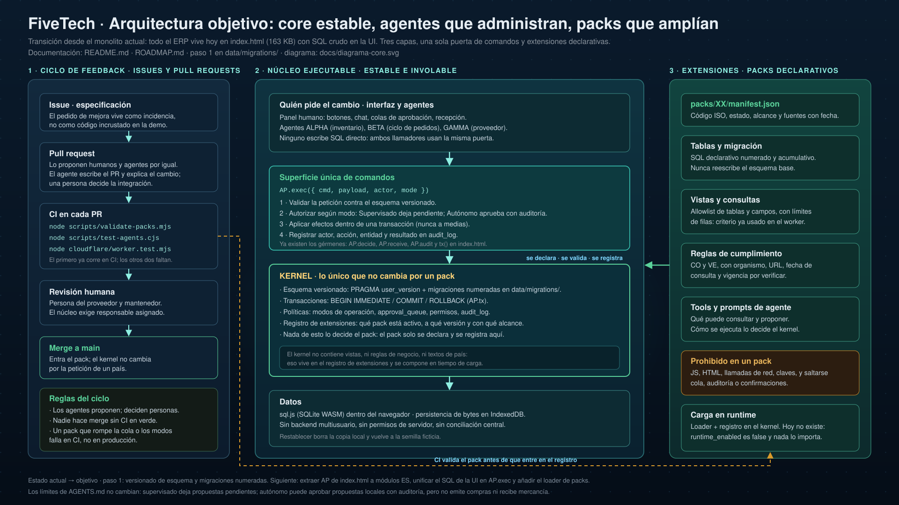

# FiveTech

**FiveTech: ERP Agéntico y Autónomo, con supervisión humana.**

## El concepto

Un ERP dirigido por agentes de IA que operan de forma autónoma sobre las operaciones de la empresa: optimizan inventario, ajustan pronósticos de ventas y reaccionan ante riesgos logísticos. Los agentes actúan solos, pero bajo supervisión humana: el usuario sigue sus decisiones en el panel y valida sus propuestas (¿Implementar?) antes de que se ejecuten.

Este repositorio contiene el prototipo de la interfaz: un panel de "Operaciones Inteligentes 2030" que muestra cómo se vería esa relación entre agentes autónomos y supervisión humana.

## Qué incluye la demo

- Panel de métricas (ingresos, margen, inventario, satisfacción del cliente)
- Tres agentes de IA en operación: ALPHA (inventario), BETA (ventas) y GAMMA (logística)
- Alertas y acciones de agentes en tiempo real
- Gráficos de pronóstico de demanda y costo de operaciones (Chart.js)
- Chat arrastrable con el asistente, donde el humano pregunta y decide

Todo el contenido es simulado: no hay backend ni datos reales. Es un prototipo de interfaz, no un producto funcional.

## Arquitectura: del monolito a un core extensible



Hoy todo el ERP vive en un único `index.html` (163 KB): esquema, semilla, vistas con SQL crudo, agentes y modos de operación están acoplados. Eso impide que alguien —humano o agente— amplíe el sistema sin editar el núcleo, y hace que un PR sea difícil de revisar porque no hay dónde separar. La transición se documenta en [ROADMAP.md](ROADMAP.md) y se dibuja en [`docs/diagrama-core.svg`](docs/diagrama-core.svg).

El objetivo son tres capas:

1. **Kernel estable e inviolable.** Solo cuatro cosas: esquema versionado (`PRAGMA user_version` + `data/migrations/` numeradas), transacciones (`AP.tx`), políticas (modos de operación, `approval_queue`, `audit_log`, permisos) y el registro de extensiones. El kernel no contiene vistas ni reglas de negocio de un país.
2. **Superficie única de comandos.** `AP.exec({cmd, payload, actor, mode})` valida contra el esquema, autoriza según modo, aplica los efectos dentro de una transacción y registra el resultado en `audit_log`. La interfaz y los agentes usan **la misma puerta**: nadie escribe SQL directo.
3. **Extensiones declarativas (packs).** Un pack declara tablas y migración, vistas y consultas sobre allowlist, reglas de cumplimiento con fuente y fecha, y las tools/prompts de su agente. **Sin JS arbitrario**: no red, no claves, nada que se salde cola, auditoría o confirmaciones. Hoy los packs son contratos estáticos —`runtime_enabled` es `false` y nada los importa en runtime—; el loader es el paso 4 de la transición.

### La misión de los agentes

| | **A · Operativa diaria** | **B · Evolución del core** |
|---|---|---|
| **Qué hacen** | Leen, calculan y proponen dentro del ERP | Proponen cambios en el propio sistema |
| **Cómo entran** | Por `AP.exec`, igual que el humano | Issues → pull requests |
| **Quién decide** | Una persona en la cola de aprobaciones | Una persona en la revisión del PR |
| **Velocidad** | Segundos | Días, con CI en medio |
| **Límite** | Supervisado deja la propuesta pendiente; Autónomo aprueba propuestas locales con auditoría pero **no compra ni recibe** | **Nunca hace merge**, nunca toca `index.html`, `data/schema.sql` ni `data/seed/demo.json` para añadir un pack |

Los subagentes jurídicos son diseño, no ejecutores: sin país, sector y fuentes verificadas no emiten dictámenes ni aprueban propuestas.

### Cómo llega el feedback

- **Issues** → especificación. El pedido de mejora vive como incidencia, no como código colado en la demo.
- **Pull requests** → proponen humanos y agentes. El agente redacta el PR; una persona decide.
- **CI** → la puerta: `node scripts/validate-packs.mjs` ya corre en cada PR. `scripts/test-agents.cjs` (17 casos) y `cloudflare/worker.test.mjs` existen pero **aún no están en CI**.
- **Núcleo** → cambia en un PR aparte, con responsable del núcleo, nunca dentro de un pack.

## Contenido del repositorio

- `index.html` — la demo completa en un solo archivo (HTML + CSS + JS; Chart.js se carga desde CDN). Es el monolito que la transición va a descomponer.
- `data/` — `schema.sql` (esquema base), `seed/demo.json` (semilla ficticia) y, desde el paso 1, `migrations/` con las migraciones numeradas.
- `packs/` — contratos por país (`manifest.json` + `README.md`). Hoy estáticos: `validate-packs.mjs` comprueba estructura, fuentes y que ningún borrador esté habilitado; nada los carga en runtime.
- `scripts/` — `validate-packs.mjs` (en CI), `test-agents.cjs` (17 casos Playwright) y `ci_erp_preflight.py`.
- `cloudflare/` — puente remoto y sus tests (`worker.test.mjs`).
- `docs/` — diagramas, guías y evidencias. `docs/diagrama-core.svg` dibuja la arquitectura objetivo.
- `instinct-*.mjs` — transporte de correo del cerebro externo.

## Cómo verla

Abre `index.html` en cualquier navegador, o publica el repositorio con GitHub Pages para verla en línea.

## Estado

Prototipo en desarrollo inicial. Transición a core extensible en curso: paso 0 (diagrama) completado, paso 1 (esquema versionado) en curso; el detalle y el orden están en [ROADMAP.md](ROADMAP.md).

Verificación local:

```bash
node scripts/validate-packs.mjs   # contratos de packs (también en CI)
node instinct-gmail-test.mjs      # 27 fixtures de firma y MIME
node cloudflare/worker.test.mjs   # validación del puente
node scripts/test-agents.cjs      # 17 casos sobre la UI real (requiere npm install --no-save playwright sql.js@1.13.0 chart.js@4.4.8)
```

## Trabajo de los agentes y pruebas

Consulta [funciones exactas, límites y verificación local](docs/agentes-erp.md). ALPHA usa el modelo; BETA y GAMMA son reglas locales. Los subagentes jurídicos son diseño, no ejecutores.


## Nombre del repositorio y continuidad de datos

El repositorio es [FiveTechSoft/Core](https://github.com/FiveTechSoft/Core). La demo está en https://fivetechsoft.github.io/Core/. GitHub Pages sigue publicando `main` desde la raíz; la antigua ruta `/AdaptaPro/` no redirige.

Se mantienen las claves de IndexedDB y localStorage, los protocolos, el worker y las aplicaciones OAuth existentes. El origen sigue siendo `https://fivetechsoft.github.io`, por lo que cambiar la ruta no cambia el almacenamiento del navegador. No se han borrado ni reiniciado datos.

Los enlaces del antiguo repositorio redirigen al nuevo. Para actualizar un clon local: `git remote set-url origin https://github.com/FiveTechSoft/Core.git`.
