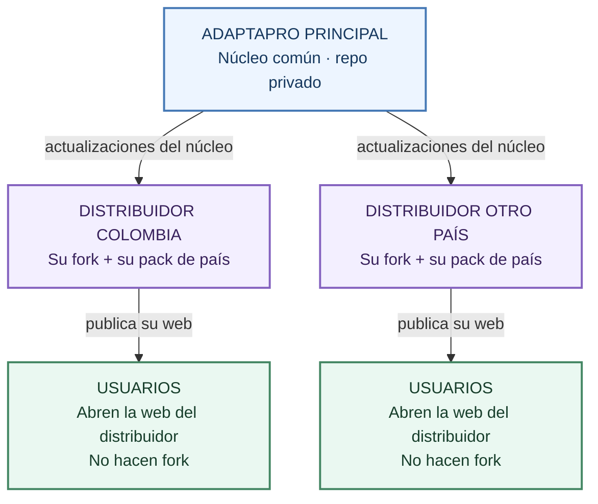

# AdaptaPro: un núcleo, distribuidores por país y usuarios sin forks

**Sí, conviene separar estas tres cosas.** El código común se mantiene una vez. Cada distribuidor adapta su país. El usuario final solo abre la web.

> Es el modelo propuesto, no una red de distribuidores ya montada. Antes de invitar a alguien hay que revisar permisos, licencia, alojamiento y cómo se tratarán sus datos reales.

## Primero probar; montar viene después

| Fase | Qué hace el candidato | Qué se le pide |
|---|---|---|
| **1 · Probar** | Abre la demo web existente y prueba los datos ficticios disponibles. | Nada que instalar, ningún fork, ninguna cuenta técnica. Un escenario demo de su país se prepara si está disponible; no se promete que exista ya. |
| **2 · Piloto** | Si le interesa, prepara su fork y puente con la guía fácil; invita a sus testers. | Revisar cuenta/permisos, configurar una vez y comprobar el recorrido real. Solo datos de prueba. |
| **3 · Distribuidor** | Mantiene su pack de país, su dominio y el servicio. | Validar reglas, acordar licencia/soporte y contratar planes solo si hacen falta. |

**Para probar no hay que montar nada.** La demo actual abre sin ese montaje; el puente con Instinct aún debe completar su prueba real. No confundir abrir la demo con tener ya todo el servicio listo.

## Qué hace cada uno

| Quién | Qué mantiene | Qué no necesita hacer |
|---|---|---|
| **AdaptaPro principal** | El núcleo común y sus mejoras. Decide quién accede al repo privado. | Hacer una copia distinta del núcleo por cada usuario. |
| **Distribuidor por país** | Su copia conectada al principal (fork), su pack de país y su web. | Reescribir todas las mejoras del núcleo a mano. |
| **Usuario final** | En esta demo, sus datos en su propio navegador. | Crear cuenta GitHub, hacer fork o instalar el puente. |

Un **fork** es una copia de código conectada al proyecto original. Lo usa quien adapta el programa, no quien usa el ERP para trabajar.

El **pack de país** contiene las adaptaciones que correspondan: idioma, reglas y configuración. Las reglas fiscales o laborales necesitan validación; tener un pack no equivale a estar certificado.

## Cómo controlar quién hace fork

- **Repo público:** cualquiera puede hacer fork. No puedes impedirlo con un botón. La licencia puede regular usos, pero no impide descargar código visible.
- **Repo privado:** solo personas con acceso, y además debe estar permitido hacer fork. El dueño revisa colaboradores y política de forks.
- **Cuenta personal del distribuidor:** GitHub permite el fork privado si tiene acceso y el dueño lo permite.
- **Organización del distribuidor:** para recibir un fork privado necesita **GitHub Team** y permiso para crear repositorios. **Una organización GitHub Free no puede recibir ese fork privado.**

Los forks privados siguen siendo privados y tienen reglas de permisos heredadas. No son cajas independientes con aislamiento total garantizado: revisar quién accede a cada uno antes de usarlos. Retirar acceso no borra las copias que alguien ya descargó en su ordenador.

## Cómo llegan las mejoras sin romper el país

1. AdaptaPro publica una mejora del núcleo.
2. El distribuidor trae esa mejora a una rama de prueba de su fork.
3. Se comprueba que el pack de país sigue funcionando.
4. Si hay un choque entre cambios, se revisa antes de publicar.
5. Se actualiza la web del distribuidor.

**Un agente puede ayudar con este trabajo**, pero no se promete que mezcle cambios siempre sin errores. Primero prueba y revisión; después publicación. Para facilitarlo, mantener núcleo y packs en carpetas separadas y evitar cambiar el núcleo solo para un país.

## Dónde publica su web el distribuidor

| Opción | Cuándo encaja | Lo que hay que tener claro |
|---|---|---|
| **GitHub Pages + repo privado** | Quiere alojarlo todo en GitHub. | Cuenta personal: GitHub Pro. Organización: GitHub Team o plan compatible. GitHub Pro tiene un precio de referencia de US$4/mes; comprobar precio y condiciones de contratación actuales. |
| **Cloudflare Pages + repo privado** | Quiere usar Cloudflare también para la web. Es la opción propuesta para la demo. | Tiene plan gratuito con límites y conecta repos privados. Esto no elimina la necesidad de GitHub Team si el fork privado va a una organización. |
| **Repo público + GitHub Pages** | Decide publicar el código y su pack. | Alojamiento disponible en GitHub Free. Código y pack del repo quedan visibles y se pueden forkear. Un fork privado del principal no puede volverse público por sí solo. |

No contratar ni cambiar planes sin revisar precio, límites y permisos del distribuidor. Cloudflare Pages Free incluye, por ejemplo, 500 compilaciones al mes; no es una promesa de recursos sin límite.

## Repo privado no significa web secreta

**Lo que una web pública manda al navegador se puede ver y copiar:** HTML, JavaScript, estilos y archivos de datos que publique.

Eso ocurre igual con GitHub Pages y con Cloudflare Pages. Si el pack del país se incluye en esos archivos públicos, también se puede copiar. Cambiar de alojamiento **no protege ese pack**.

Lo que no se publica automáticamente con la web:

- La historia, issues y archivos privados del repo que no se sirvan como parte de la web.
- Las claves privadas y tokens guardados solo en el servidor.
- El código que se ejecuta solo en el servidor.
- Los datos locales de otros usuarios. En esta demo, cada navegador guarda los suyos.

Las consultas que se envían a Instinct sí salen del navegador: el puente y los buzones guardan mensajes según la retención explicada en la [guía fácil del puente](puente-instinct-facil.md). Esto no es una solución de datos de clientes reales; esa decisión queda pendiente.

El valor del distribuidor puede estar en **reglas validadas, actualizaciones, servicio y soporte**, no en suponer que nadie verá el JavaScript. Si una regla o dato debe ser confidencial, no debe ir en archivos públicos. Su ubicación se decide aparte, no se añade a esta demo por rutina.

## Decisión práctica para esta primera ronda

**Forks para distribuidores. Web para usuarios. Datos demo en cada navegador.**

Cloudflare Pages es una opción de alojamiento, no una forma de saltarse los permisos de GitHub ni de esconder código que se entrega al navegador. Antes de crear cada fork, revisar si su destino es cuenta personal u organización y el plan que le corresponde.

---

Fuentes revisadas el 30 de septiembre de 2026:

- [Permisos y visibilidad de forks](https://docs.github.com/en/pull-requests/collaborating-with-pull-requests/working-with-forks/about-permissions-and-visibility-of-forks)
- [Planes de GitHub](https://docs.github.com/en/get-started/learning-about-github/githubs-plans)
- [Referencia oficial del precio de Pro](https://docs.github.com/en/enterprise-cloud@latest/get-started/learning-about-github/faq-about-changes-to-githubs-plans)
- [GitHub Pages](https://docs.github.com/en/pages/getting-started-with-github-pages/about-github-pages)
- [Cloudflare Pages: límites](https://developers.cloudflare.com/pages/platform/limits/)
- [Cloudflare Pages: conexión con GitHub](https://developers.cloudflare.com/pages/configuration/git-integration/github-integration/)
