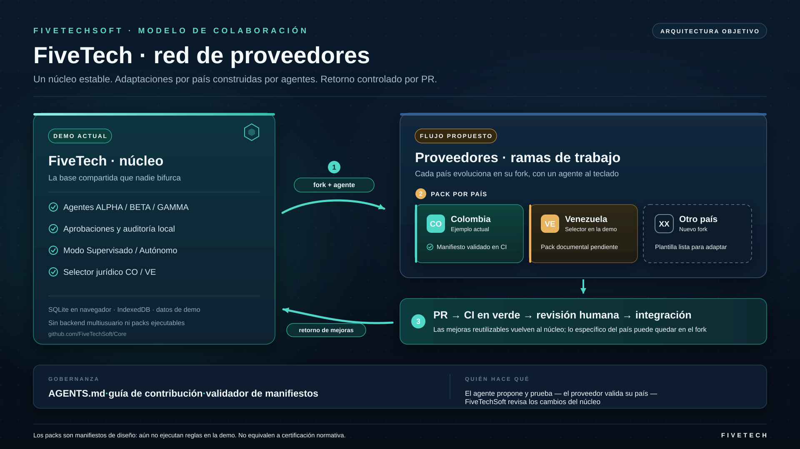

# FiveTech: núcleo común, adaptación local

Documento de apoyo para presentación a proveedores · 28 de septiembre de 2026

## Tesis comercial

Una empresa de cada país necesita procesos, fuentes normativas y lenguaje propios. Proponemos que los proveedores partan de un mismo FiveTech, trabajen en un fork con ayuda de un agente y devuelvan mejoras generales mediante pull requests revisados. El núcleo no se bifurca por contrato: las diferencias locales se documentan en packs versionados. El proveedor conserva control sobre su propuesta y responsabilidad sobre su validación local.

**Mensaje para la presentación:** «Una base compartida; adaptaciones por país bajo responsabilidad local; mejoras comunes que regresan al núcleo tras revisión humana». No afirmar que ya existe una plataforma multiempresa o un motor legal validado.

## Cómo funcionaría

1. **Núcleo:** experiencia y flujos de aprobación comunes. En la demo actual reside en `index.html`; la base SQLite vive en cada navegador, con persistencia local IndexedDB y semilla ficticia.
2. **Fork del proveedor:** entorno de experimentación. El agente lee `AGENTS.md`, implementa cambios aislados en una rama y entrega diff, pruebas y fuentes. La persona del proveedor decide qué propone; el agente no certifica normas.
3. **Pack del país:** manifiesto, alcance, fuentes y responsable local. `packs/CO/manifest.json` es un índice de la demo Colombia. Hoy no hay carga dinámica del manifiesto ni reglas activadas por él. El selector CO/VE y la demostración de nómina Colombia están codificados en la aplicación existente.
4. **Regreso al núcleo:** PR, validación de esquema en CI y revisión humana. Las pruebas legales, funcionales y de seguridad más profundas deben aportarse y revisarse antes de producción. Una mejora reutilizable se integra; una personalización del cliente puede quedarse en su fork.

## Qué puede mostrarse hoy, sin exagerar

La demo muestra paneles, agentes ALPHA/BETA/GAMMA, cola de aprobaciones con auditoría, modos Supervisado y Autónomo, selector jurídico CO/VE y ejemplo de nómina Colombia con fuentes en la interfaz. Autónomo aprueba propuestas locales nuevas con auditoría; no compra ni recibe mercancía. Los importes y datos del escenario son ficticios. No hay aislamiento por cliente, backend transaccional, permisos de servidor, sincronización multiusuario ni garantía de actualización legal. Los packs de este PR son una estructura de colaboración y validación de metadatos, no un sistema plug-and-play.

## Ruta técnica para convertir la visión en producto

- **Fase 1 (este repositorio):** contrato de manifiesto, ejemplo CO, guía de contribución, validador y CI; sin tocar la ejecución de la demo. Indicador: PRs pequeños y verificables, no países «activos».
- **Fase 2 (por diseñar):** separar el motor de reglas del HTML, crear API versionada de packs, pruebas de contrato, fechas de vigencia y rollback. Validar casos límite de cada jurisdicción y permisos por rol.
- **Fase 3 (antes de clientes reales):** backend multiusuario, aislamiento de datos, seguridad y secretos del lado servidor, trazabilidad central, actualización normativa, revisión profesional local y soporte operativo. Presupuesto, plazos y acuerdos con proveedores se negocian por separado.

## Modelo de responsabilidad

| Parte | Aporta | No puede delegar al agente |
|---|---|---|
| FiveTechSoft | Núcleo, interfaces de extensión, CI y revisión de integración | Seguridad y cambios del núcleo |
| Proveedor local | Conocimiento sectorial, fuentes, pruebas y soporte de su país | Revisión normativa y promesas a sus clientes |
| Agente de desarrollo | Propuesta de código, diff, tests y documentación | Aprobación jurídica, publicación o aceptación de PR sin personas responsables |

**Próximo paso comercial:** piloto con un proveedor y un solo caso de uso verificable; acordar jurisdicción, responsable local, criterios de aceptación, datos ficticios para la demo y plan de mantenimiento. Medir tiempo de adaptación y coste de mantener el fork sincronizado. No ofrecer «cumplimiento automático» antes de pruebas y dictamen local.

Repositorio: https://github.com/FiveTechSoft/AdaptaPro · Demo: https://fivetechsoft.github.io/AdaptaPro/
