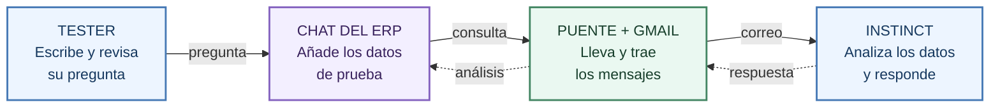

# Del chat del ERP a Instinct, y de vuelta

**La idea:** tú haces una pregunta sobre los datos de prueba. Instinct la recibe, la analiza y devuelve su respuesta al chat.

El tester no configura Google ni Cloudflare. Eso lo prepara una sola vez quien monta el prototipo.

> **Estado actual:** el código está preparado, pero el puente todavía no está funcionando. Falta desplegarlo, conectar Google y probar un viaje completo. No hay envíos automáticos activados.

## El viaje de una pregunta



**Por ejemplo:** "ALPHA, ¿por qué SKU-451 necesita reposición?" Instinct debe explicar su respuesta usando los números que recibió. No debe inventar datos ni decir que ha comprado nada.

## Qué es cada cosa

| Nombre que verás | En palabras normales |
|---|---|
| **Cloudflare** | El sitio donde funciona el puente, aunque cierres tu pestaña. |
| **Worker** | El pequeño programa que lleva y trae los mensajes. |
| **Cola** | Una bandeja de mensajes pendientes. No es una base de datos de clientes. |
| **Turnstile** | La comprobación que frena a los robots para que no abusen del correo. |
| **Permiso de Google** | Tu autorización para que el puente lea y envíe correo desde el buzón del ERP. |

## Qué se guarda y qué no

- El ERP sigue guardando sus datos **en el navegador de cada tester**. No se comparten entre testers ni se sincronizan con otro dispositivo.
- El puente guarda **la pregunta y los datos mínimos incluidos en ese mensaje**, hasta 24 horas. Al recoger la respuesta, borra la pregunta y esos datos de la cola.
- Gmail y el destinatario conservan sus copias de correo. Borrar la cola **no borra los correos**.
- En esta ronda se usan **solo datos ficticios**. Dónde irán los datos reales de clientes se decidirá después.

> **"NO AUTENTICADA"** significa que podemos relacionar la respuesta con la pregunta, pero todavía no probar con fuerza quién la escribió. Se muestra como texto de análisis. No compra, no cambia el stock y no ejecuta herramientas.

## La receta para quien monta el prototipo

Estos pasos son para el dueño. **Los testers no los hacen.** No avances al siguiente hasta comprobar el anterior.

### 1. Entrar en Cloudflare

En la terminal, dentro de la carpeta `cloudflare` del proyecto:

```text
npx wrangler login
npx wrangler whoami
```

El navegador te pide entrar y autorizar. Luego comprueba que aparece **tu cuenta correcta**.

**El precio:** esta cola usa la versión SQLite de Durable Objects, que también está disponible en el plan gratuito, dentro de sus límites. No necesitas pasar a un plan de pago solo por este diseño. Comprueba tu plan en Cloudflare antes de desplegar. No pulses "Upgrade" por rutina. Si se agota el límite gratuito, las operaciones fallan.

### 2. Crear la comprobación contra robots

En Cloudflare, abre **Turnstile** y añade un sitio:

- Nombre: `AdaptaPro puente`.
- Dominio: `fivetechsoft.github.io`.
- Modo: **Managed**.

Te da dos claves. La **Site Key es pública**: se usa en la web. La **Secret Key es privada**: no la mandes por chat ni en una captura. Guárdala tú directamente:

```text
npx wrangler secret put TURNSTILE_SECRET
```

Cuando la terminal te pida el valor, pega allí la clave privada.

### 3. Publicar el puente, todavía apagado

Comprueba estos valores en `wrangler.jsonc`: `SEND_ENABLED` es `false`, `RESPONSE_MODE` es `disabled` y `crons` está vacío.

```text
npx wrangler deploy
```

Anota la dirección HTTPS real que te devuelva. Esa dirección y la Site Key pública se añaden a la configuración de la web. Primero comprobamos que abre la sesión y guarda una consulta de prueba. **Todavía no se envía correo.**

### 4. Dar permiso a Google una vez

Este paso se hace después, con el dueño delante:

1. En tu proyecto de Google, habilita Gmail y crea un cliente de tipo **Desktop**. Descarga su archivo de configuración a una carpeta privada de tu ordenador. No lo subas al repo ni lo mandes por chat.
2. En la carpeta `cloudflare`, ejecuta el ayudante indicando dónde está ese archivo:

```text
python3 oauth_local.py RUTA_DEL_ARCHIVO_PRIVADO.json
```

En Windows, si usas el lanzador de Python, puedes escribir `py` en lugar de `python3`. Si la ruta tiene espacios, ponla entre comillas.

3. Se abre Google. Elige **fivetech2@gmail.com** y revisa el permiso de lectura y envío. El ayudante comprueba la cuenta y guarda las credenciales directamente en Cloudflare, sin mostrarlas en el chat.

El correo de login de Cloudflare puede ser distinto. El que importa aquí es el buzón ERP. El permiso de Google puede caducar o revocarse; no significa acceso para siempre.

### 5. Probar antes de encenderlo para todos

Revisamos cuenta, destinatario y modo de prueba. Después habilitamos **un primer envío real** a `3xdy4j@mail.instinct.com`. Instinct responde y comprobamos que vuelve al tester correcto. Solo entonces se decide activar las comprobaciones periódicas.

**Tener el código publicado no significa que el puente ya funcione.**

## Cómo sabremos si los agentes funcionan bien

| Prueba | Qué esperamos |
|---|---|
| **ALPHA · stock** | Cita los números de SKU-451 y explica la alerta. |
| **BETA · pedidos** | Usa solo los pedidos y cantidades del mensaje. |
| **GAMMA · logística** | Compara solo los proveedores, precios y plazos recibidos. |
| **Dos testers a la vez** | Cada uno ve su respuesta, nunca la del otro. |
| **Cerrar y volver** | La respuesta se recupera al volver al mismo navegador, mientras la sesión siga vigente. |

Medimos solo esto: **datos citados correctos, tiempo real de ida y vuelta y cero acciones fuera de alcance**. Si falta un dato, el agente debe decirlo.

---

Para quien necesite los detalles: [guía de montaje y límites](cloudflare-bridge.md). Precio y límites: [documentación oficial de Cloudflare](https://developers.cloudflare.com/durable-objects/platform/pricing/).
